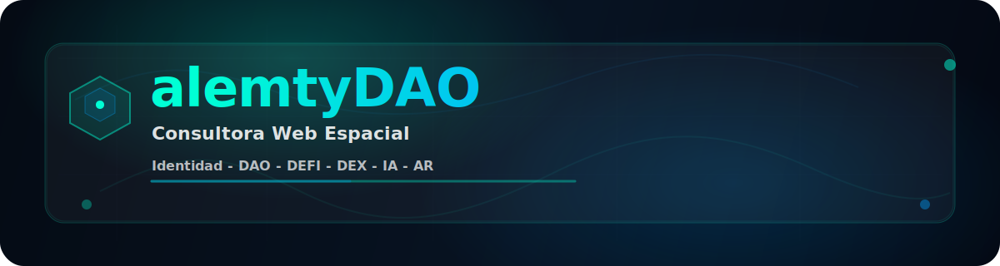

  

# alemty.eth — DAO v0.8

**Estado:** Activo / En desarrollo  **Enfoque:** Identidad · Coordinación · Economía sostenible · Gobernanza auditable  **Principio rector:** *El mérito no se compra. El valor circula. El poder se bloquea.*

> **Disclaimer rápido:** alemty no representa equity, no promete retornos y no es un instrumento financiero. La DAO no es entidad legal; participar es bajo propio riesgo.  

---

## ¿Qué es alemty?

alemty es una **plataforma de identidad, coordinación y economía social** diseñada para construir sistemas humanos sostenibles a largo plazo.

No es un token. No es solo una DAO. No es un foro. No es un DEX.

Es un **sistema completo por capas** que comienza con la identidad individual (DID), evoluciona hacia coordinación social (DAO), activa una economía útil (DeFi), habilita ejecución económica (DEX), integra asistencia operativa (IA) y finalmente escala hacia una **consultora espacial y tecnológica** capaz de analizar, coordinar y ejecutar proyectos complejos de forma auditable.

alemty nace como respuesta a errores estructurales comunes en Web3:
- Especulación sin utilidad
- Reputación comprable
- Gobernanza capturada por capital
- Sistemas opacos
- Modelos “pay to win”

---

## La evolución del sistema (visión completa)

alemty **no salta etapas**. Evoluciona de forma orgánica:

- **ID / DID**    Tu identidad es tu wallet. No hay correos, contraseñas ni intermediarios.

- **DAO (Foro social)**    Interacción humana real: publicaciones, comentarios, likes, puntos, salas temáticas. Aquí se genera el mérito social.

- **DeFi (economía programable)**    La economía aparece como consecuencia de la interacción, no al revés.

- **DEX (ejecución económica)**    Intercambio, staking y gobernanza económica por fases, sin dependencia temprana de liquidez externa.

- **IA (asistencia operativa)**    Agentes que analizan, resumen y simulan escenarios. **La IA no gobierna**, solo asiste.

- **AR (web espacial)**    Visualización espacial de información, jerarquías, flujos y proyectos.

- **Resultado final: Consultora Espacial**    Análisis, simulación, coordinación, reporting y ejecución verificable para proyectos reales.

---

## ¿Por qué alemty es diferente?

La mayoría de proyectos Web3 fallan porque **mezclan cosas que no deben mezclarse**:
- mérito con dinero
- poder con liquidez
- reputación con especulación

alemty separa explícitamente **cuatro funciones fundamentales**:
- **Mérito**
- **Valor**
- **Poder**
- **Deuda**

Cada una tiene su propio mecanismo. Ninguna puede sustituir a otra.

---

## Los 4 componentes clave del sistema

alemty utiliza **3 tokens funcionales y 1 antitoken**. Cada uno tiene un propósito único y no intercambiable.

### 1) Dharma (DS / DC) — Mérito / Experiencia (off-chain)
- **No transferible**
- Representa tu historial real de participación y reconocimiento.

**DS (Dharma Social):**
- Se obtiene cuando otros reconocen tu aporte (likes, puntos).
- Es permanente.

**DC (Dharma Condicional):**
- Se obtiene por compromisos temporales (staking/locks) con cap.
- Tiene límites para evitar comprar niveles.

👉 El mérito **no se compra**.

### 2) Karma — Deuda social (Antitoken, off-chain)
- Aparece cuando rompes compromisos o violas reglas.
- **No se paga con dinero, tokens ni swaps**.
- Solo se paga con mérito social futuro (DS).

👉 El sistema recuerda.

### 3) Aura — Utility interno
- Es el **gas social** del ecosistema.
- Se usa para publicar, impulsar contenido, crear salas y acceder a funciones avanzadas.
- Se genera **solo a partir de Dharma Social**.
- Tiene decay controlado y **cap dinámico** ligado al pool.
- **No está diseñado para especulación externa**.

👉 Aura habilita participación, no riqueza.

### 4) ALEM — Token de gobernanza (Base)
- Representa coordinación y dirección.
- No otorga dividendos.
- El poder no es instantáneo: se obtiene mediante **bloqueo temporal** (ve/escrow).
- Supply máximo: **1,000,000,000 ALEM**.

👉 Gobernanza sin plutocracia.

---

## Earn & Play — No Pay to Win

En alemty **no se gana pagando**. Se gana participando, aprendiendo y aportando.

### ¿Cómo se gana?
- Recibir likes → mérito
- Recibir puntos → mérito
- Aportar ideas útiles
- Participar de forma constante

### ¿Qué NO funciona?
- Comprar estatus
- Comprar poder político
- Comprar reputación

alemty está diseñado para:
- aprender jugando
- crecer aportando
- progresar sin especulación

---

## Sistema de niveles y nobleza

alemty introduce un sistema de **progresión visible** inspirado en MMORPGs:
- Los niveles reflejan mérito acumulado.
- La nobleza es **un rol**, no una propiedad.
- El estatus se mantiene solo si el compromiso continúa.
- El poder se pierde si se abandona (decadencia).

---

## Arquitectura del sistema

alemty está diseñado con **responsabilidad única por capa**:
- Identidad
- Interacción social
- Estado económico
- Gobernanza
- Ejecución económica
- IA
- Visualización espacial

Esto permite:
- auditar cada parte
- escalar sin romper el sistema
- reemplazar módulos sin colapsar el todo

---

## Backend (persistencia sin sacrificar auditabilidad)

El backend está diseñado para **estado compartido** y **escrituras autenticadas**:
- Frontend permanece estático y auditable.
- Todas las escrituras requieren verificación SIWE.
- El backend es reemplazable, determinista y auditable.

Componentes:
- **Worker SIWE**: emite JWT tras verificar firma.
- **Worker API**: valida JWT y opera sobre **D1**.

Tablas canónicas (D1): `users`, `posts`, `comments`, `reactions`.

---

## Despliegue (resumen)

- SIWE Worker: endpoints `GET /nonce` y `POST /verify` (devuelve `{ ok, address, chainId, token }`).
- API Worker: expone `/api/*`.
- Ambos deben compartir el mismo `JWT_SECRET`.
- Configurar CORS para permitir `Authorization` desde el frontend.

---

## Documentación canónica

Este repo incluye documentos de referencia que funcionan como **fuente de verdad** del sistema:
- **Tokenomics Rulebook** (sistema económico canónico)
- **Constitución** (leyes núcleo, gobernanza, quórums)
- **Whitepaper** (visión y arquitectura por capas)
- **Nobleza** (estatus político visible basado en ve)
- **Founder & IP Statement** (propiedad intelectual)

---

## Licencia

MIT y Derechos de Autor MX

---

## Disclaimer

alemty:
- no representa equity
- no promete retornos
- no es un instrumento financiero
- es un experimento social, económico y tecnológico

Participar es una decisión personal y responsable.

---

## TL;DR

**alemty = identidad soberana + mérito real + economía útil + poder bloqueado + aprendizaje continuo, evolucionando hacia una consultora espacial auditable y sostenible.**
