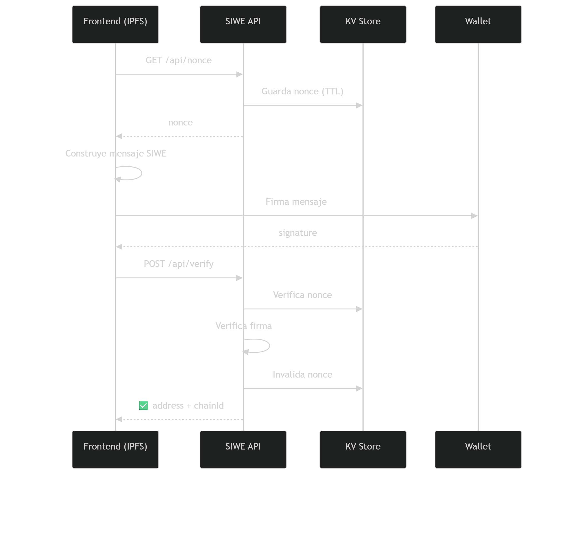

# 🪪 alemty.eth — SIWE API

Implementación **Sign‑In With Ethereum (SIWE)** para el ecosistema **alemty.eth**, diseñada para funcionar con **frontend distribuido en IPFS** y **backend serverless** mediante **Cloudflare Pages Functions**.

Esta API permite autenticar identidades Ethereum (DID) de forma segura, sin custodiar llaves, usando firma criptográfica y protección anti‑replay.

---

## ✨ Características

- ✅ Autenticación **SIWE estándar**
- ✅ Protección **anti‑replay** mediante nonce
- ✅ Backend **serverless** (Cloudflare Pages Functions)
- ✅ Compatible con **IPFS** (frontend desacoplado)
- ✅ Sin custodia de llaves
- ✅ Preparado para DAO / DID / gobernanza

---

## 📁 Estructura

```txt
/functions/api
├── nonce.js    # Genera nonce seguro (anti‑replay)
├── verify.js   # Verifica firma SIWE
└── README.md   # Documentación del API

🔐 Flujo de autenticación (SIWE)



🧠 Seguridad

🔐 Nonce de un solo uso
⏱️ TTL automático (KV)
🔁 Protección contra replay attacks
🚫 Sin custodia de llaves privadas
🚫 Sin sesiones persistentes por defecto


La persistencia de sesión (cookies, JWT, roles, etc.) se deja a criterio de la capa de aplicación.

⚙️ Requisitos
Cloudflare Pages / Workers
Debes configurar un KV Namespace:

Binding name: SIWE_NONCES

Y asociarlo al proyecto de Pages Functions.

🌐 Frontend (IPFS)
El frontend NO vive en /functions ni en este API.
Flujo esperado desde el frontend:

GET /api/nonce
Construir mensaje SIWE
Firmar con wallet (personal_sign)
POST /api/verify
Usar address como DID


🧩 Integración recomendada

shared/js/auth-siwe.js → lógica SIWE
shared/js/shell.js → estado global DID
IPFS → solo archivos estáticos
Cloudflare → lógica sensible


🚧 Extensiones futuras (opcionales)

Validación de dominio (domain)
Restricción por chainId
Roles DAO por address
JWT / cookie httpOnly
Rate limiting
Logs de auditoría


📜 Principios

La identidad precede al token.
La firma reemplaza al email.
La DAO comienza con el DID.


📄 Licencia
MIT — uso libre, sin garantías.

---

Si quieres, en el siguiente paso puedo:

- ✅ Ajustarlo para **README público vs privado**
- ✅ Añadir una sección **“Threat model”**
- ✅ Generar el **README del frontend SIWE**
- ✅ Unificar documentación **IPFS + CF + DAO**

Tú dime.